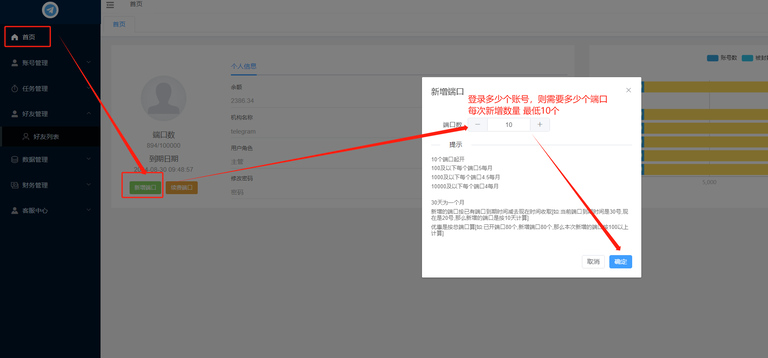
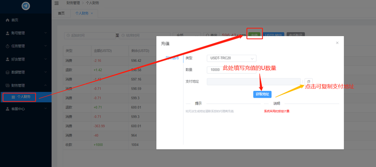

# 端口与充值

1.端口不具有设备属性，仅表示能同时操作使用多少账号。2.每个账号登录上线都有唯一设备，不会重复使用，所以可以随意切换账号登录。

## 新增端口

端口的数量意味着能同时登录操作多少个账号。TG账号可以随时进行"启用"和"归档"。

归档：TG账号备用，不占用端口，无法操作
启用：TG账号占用端口数量，进行操作

### 步骤一：打开 "首页" 点击 "新增端口"

### 步骤二：填写端口数量 点击 "确定"

注：云控收费货币单位为USDT

端口 = 账号可登录数；默认有效期为30天；

在端口的有效期内二次新增的端口，到期时间以第一次开端口的有限期为准。（收费按剩余有效期计算）

续费端口：当前已有的端口数量进行续费，不可指定数量；月份填1，表示当前端口数有效期顺延30天。

## 账户充值

打开 "财务管理" 的 "个人财务" 点击 "充值"

此处的数量为需要充值的USDT数量，比如充值100U就填写100
填写数量后点击"获取地址"，半小时内往页面显示的地址进行支付，系统自动到账。
